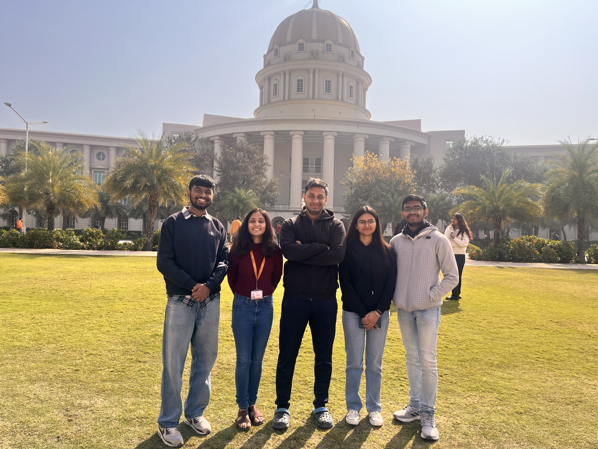
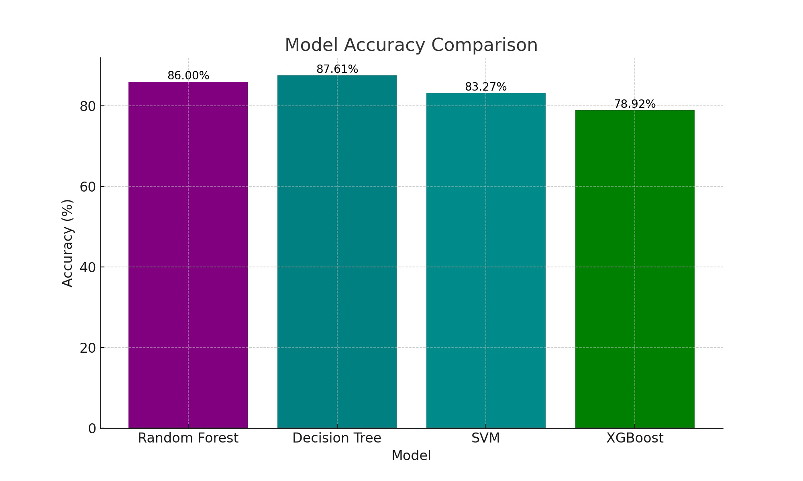

<p align="center" width="100%">
    
</p>

# SIBYL: STRATEGIC INTELLIGENCE FOR BUILDING YOUR LEGACY
<p align="center"> 
    <!-- Badges for Licenses, Status, etc. -->
</p>

SIBYL is a cutting-edge machine learning ensemble model designed to empower decision-making processes. Developed as part of Dell's Hack2Hire initiative, this project leverages the power of data-driven insights to shape your future strategies. Deployed using Streamlit, SIBYL offers a seamless and interactive user experience.


[]()

<p align="center" width="100%">
    
</p>

<!-- TOC -->

- [REPOSITORY STRUCTURE](#Repository-Structure)
- [DEPLOYMENT](#deployment)
- [TEAM](#team)
- [CITATION](#citation)
  

<!-- /TOC -->

## Project Structure

```
Employee-Career-Path-Navigator/
│
├── pythonFunctions       # Model training,prediction and GUI
├── data/                 # Dataset used for training and testing
├── .streamlit/           # Streamlit app deployment file
├── requirements.txt      # Dependencies for the project
└── README.md
```

## Deployment

To deploy SIBYL on Streamlit:

1. Clone the repository: 
   ```
   git clone https://github.com/Ritabrata04/Employee-Career-Path-Navigator.git
   ```
2. Install dependencies:
   ```
   pip install -r requirements.txt
   ```
3. Run the Streamlit app:
   ```
   streamlit run app.py
   ```

## Team

Meet the brilliant minds behind SIBYL:

<p align="center" width="100%">
    
</p>
<p align="center">
    [From Right to Left] 
    <a href="https://github.com/Ritabrata04" target="_blank">Ritabrata</a>,
    <a href="https://github.com" target="_blank">Yashika</a>,
    <a href="https://github.com/tangorishi" target="_blank">Rishi</a>,
    <a href="https://github.com/AnkikaGithub" target="_blank">Ankika</a>,
    <a href="https://github.com/DivyangshuGithub" target="_blank">Divyangshu</a>
</p>

## Model Performance

<p align="center" width="100%">
    
</p>

## Individual Model Graphics

<p align="center" width="100%">
    
</p>
